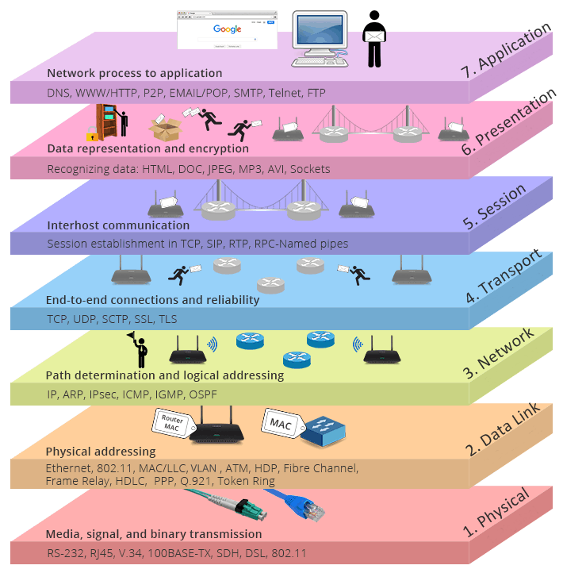

The Open Systems Interconnection model (OSI model) is a conceptual model that 'provides a common basis for the coordination 
of ISO standards development for the purpose of systems interconnection'.
<!--more-->
In the OSI reference model, the communications between a computing system are split into seven different abstraction layers:
Physical, Data Link, Network, Transport, Session, Presentation, and Application.

Below are some diagrams that I found useful in understanding this concept.

## OSI Reference Model Layers

## TCP/IP Model vs. OSI Model

[TCP/IP vs. OSI: What’s the Difference Between the Two Models?](https://community.fs.com/blog/tcpip-vs-osi-whats-the-difference-between-the-two-models.html)
