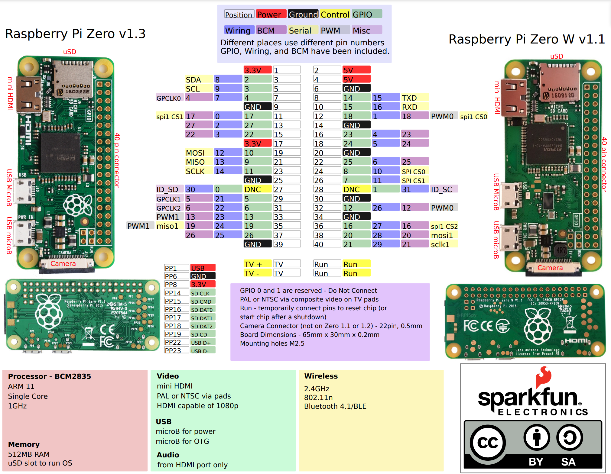
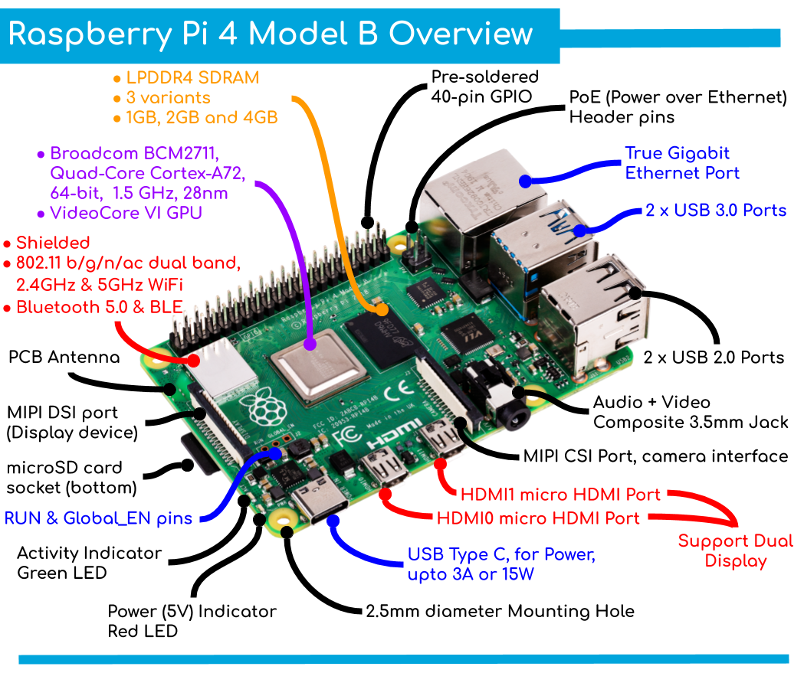

The [Raspberry Pi](https://www.raspberrypi.com/) is a series of small single-board computers (SBCs) developed 
in the United Kingdom by the [Raspberry Pi Foundation](https://www.raspberrypi.org/) in association with Broadcom. 
<!--more-->

## Models

### RPi Zero W

Basic specs:
* CPU: 1× ARM1176JZF-S 1 GHz
* Instruction set: ARMv6Z (32-bit)
* RAM: 512 MB

Links:

* [Getting Started with the Raspberry Pi Zero Wireless](https://learn.sparkfun.com/tutorials/getting-started-with-the-raspberry-pi-zero-wireless/all#introduction)

### RPi 4 Model B

Basic specs:
* CPU: 4× Cortex-A72 1.5 GHz or 1.8 GHz
* Instruction set: ARMv8-A (64/32-bit)
* RAM: 1, 2, 4 or 8 GB (shared with GPU)
  

## Topic Pages

{}
