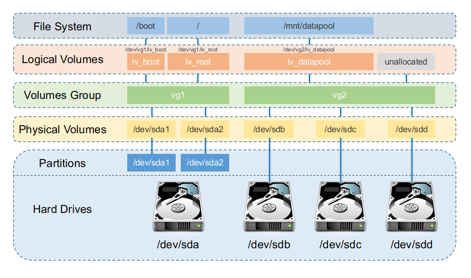

In Linux, Logical Volume Manager (LVM) is a device mapper framework that provides logical volume management for the Linux kernel.
<!--more-->
Most modern Linux distributions are LVM-aware to the point of being able to have their root file systems on a logical volume.

## Overview

Below is one of the better diagrams I have found which shows how Logical Volumes get exposed from the hard drive up to the 
file system.


[Image source](https://blog.victormendonca.com/2020/11/18/linux-logical-volume-manager/)

## Physical Volumes

Physical Volumes (PV) are disks or partitions that are available to LVM as potential storage capacity. 
They have identifiers and metadata that describes each PV.

### Create a PV

```shell
# Create a PV using the total capacity of the storage disc `c`
pvcreate /dev/sdc
```

```shell
# Creates a PV using partition 1 on the storage disc 'b'
pvcreate /dev/sdb1
```

### View PV information

You can use the `pvdisplay` or the `pvs` to view information about a PV

```shell
$ sudo pvs
  PV         VG          Fmt  Attr PSize    PFree
  /dev/sda1  ubuntu-vg-2 lvm2 a--  <931.51g    0
  /dev/sdb3  ubuntu-vg   lvm2 a--  <116.19g    0
```

```shell
$ sudo pvdisplay
  --- Physical volume ---
  PV Name               /dev/sdb3
  VG Name               ubuntu-vg
  PV Size               116.19 GiB / not usable 3.00 MiB
  Allocatable           yes (but full)
  PE Size               4.00 MiB
  Total PE              29744
  Free PE               0
  Allocated PE          29744
  PV UUID               vgrQ8Z-O6Od-b9VI-Eycu-IqGw-KSkN-aEuvCs

  --- Physical volume ---
  PV Name               /dev/sda1
  VG Name               ubuntu-vg-2
  PV Size               931.51 GiB / not usable 4.69 MiB
  Allocatable           yes (but full)
  PE Size               4.00 MiB
  Total PE              238466
  Free PE               0
  Allocated PE          238466
  PV UUID               318Q1K-DiKm-AfAS-THPC-AMf2-U7C9-FwIugu
```

### Removing a PV

If a device is no longer required for use by LVM, you can remove the LVM label with the `pvremove` command. 
Executing the `pvremove` command zeroes the LVM metadata on an empty physical volume.
If the physical volume you want to remove is currently part of a volume group, you must remove it from the volume group with the `vgreduce` command.

The following command removes the physical volume `/dev/hda1` from the volume group `my_volume_group`.
```shell
vgreduce my_volume_group /dev/hda1
```

## Volume Group

### View VG

```shell
$ sudo vgs
  VG          #PV #LV #SN Attr   VSize    VFree
  ubuntu-vg     1   1   0 wz--n- <116.19g       0
  ubuntu-vg-2   1   0   0 wz--n- <931.51g <931.51g
```

### Delete/Remove VG

To remove a Volume Group (VG) use `sudo vgremove vg_name`

```shell
$ sudo vgremove ubuntu-vg-2
  Volume group "ubuntu-vg-2" successfully removed
```

## Logical Volume

### View LV

```shell
$ sudo lvs
  LV          VG          Attr       LSize    Pool Origin Data%  Meta%  Move Log Cpy%Sync Convert
  ubuntu-lv   ubuntu-vg   -wi-ao---- <116.19g
  ubuntu-lv-2 ubuntu-vg-2 -wi-a----- <931.51g
```

### Delete/Remove LV

To remove an inactive logical volume, use the `lvremove` command. 
If the logical volume is currently mounted, `unmount` the volume before removing it. 

The following command removes the logical volume `/dev/ubuntu-vg-2/ubuntu-lv-2` from the volume group `ubuntu-vg-2`. Note that in this case the logical volume has not been deactivated.
```shell
$ sudo lvremove /dev/ubuntu-vg-2/ubuntu-lv-2
Do you really want to remove and DISCARD active logical volume ubuntu-vg-2/ubuntu-lv-2? [y/n]: y
Logical volume "ubuntu-lv-2" successfully removed
```


