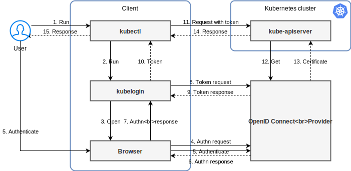

This post is about the setup of OpenID Connect (OIDC) on a Kubernetes [k3s](../../tools/kubernetes/k3s) cluster.
<!--more-->
This post use the [kubectl oidc-login plugin](https://github.com/int128/kubelogin?tab=readme-ov-file) and an existing 
OpenID Connect Provider (like [Keycloak](../tools/keycloak)) to add OIDC functionality to a [k3s](../../tools/kubernetes/k3s) cluster.

The diagram, from the [kubectl oidc-login plugin](https://github.com/int128/kubelogin?tab=readme-ov-file) documentation, 
shows how this works:



## Prerequisites

* A [k3s](../../tools/kubernetes/k3s) cluster
* An OIDC provider (like [Keycloak](../tools/keycloak)) 
* [kubectl](../../tools/kubernetes/kubectl) installed

## Setup OIDC Provider (Keycloak)

1. Create an OpenID Connect client
2. Enable 'Client authentication' for the OpenID Connect client
3. Add the `oidc-login` endpoint (`http://localhost:8000/*`) to the Valid redirect URIs
4. For your user make sure they have an `email` defined/set.

## Setup k3s

### Configure kube-api server

> My cluster nodes run k3s as a [systemd](../../operating_systems/linux/systemd) service, 
> `/etc/systemd/system/k3s.service`. 
> The service passes in a reference to the configuration file using the argument: `--config /etc/rancher/k3s/config.yaml`

In the server configuration file(s) add the following:
```yaml
kube-apiserver-arg:
- authorization-mode=Node,RBAC
- oidc-issuer-url=https://<YOUR_KEYCLOAK_URL>/realms/<REALM-NAME>
- oidc-username-claim=email
- oidc-client-id=<YOUR_OPENID_CONNECT_CLIENT_ID>
```

You will need to reboot k3s for these changes to be applied.

> Note: If you have multiple server nodes this configuration needs to be the same on each.

### Create ClusterRoleBinding

You need to configure a cluster role and a cluster role binding for the user in your Keycloak realm. 
This step is needed for enabling the Kubernetes API server to identify the user. 
In this post, we'll be associating the user with the predefined `cluster-admin` Role:

```yaml
#
# Apply with: 
#   kubectl apply -f clusterRoleBinding.yaml
#
---
apiVersion: rbac.authorization.k8s.io/v1
kind: ClusterRoleBinding
metadata:
  name: admin-user-clusterrolebinding
subjects:
  - kind: User
    name: <USER-EMAIL> # Please note that the name is case-sensitive
    apiGroup: rbac.authorization.k8s.io
roleRef:
  kind: ClusterRole
  name: cluster-admin # Specify the name of the ClusterRole to be bound
  apiGroup: rbac.authorization.k8s.io
```

## kubectl setup

1. Install [krew](../tools/kubernetes/kubectl/krew)
2. Update krew plugins: `kubectl krew update`
3. Install oidc-login kubectl plugin: `kubectl krew install oidc-login`
4. Set Up oidc-login:
    ```shell
    kubectl oidc-login setup \
      --oidc-issuer-url=<YOUR-KEYCLOAK-URL>/realms/<REALM-NAME> \
      --oidc-client-id=<OPENID_CONNECT_CLIENT_ID> \
      --oidc-client-secret=<OPENID_CONNECT_CLIENT_SECRET>
    ```
5. Create `kubectl` OIDC User for the Cluster:
    ```shell
    kubectl config set-credentials keycloak-oidc \
      --exec-api-version=client.authentication.k8s.io/v1beta1 \
      --exec-command=kubectl \
      --exec-arg=oidc-login \
      --exec-arg=get-token \
      --exec-arg=--oidc-issuer-url=<YOUR-KEYCLOAK-URL>/realms/<REALM-NAME> \
      --exec-arg=--oidc-client-id=<OPENID_CONNECT_CLIENT_ID> \
      --exec-arg=--oidc-client-secret=<OPENID_CONNECT_CLIENT_SECRET> \
      --exec-arg=--oidc-extra-scope=email,profile
    ```
6. Link the `kubectl` User to the Cluster:
    ```shell
    kubectl config set-context keycloak-oidc --namespace=default --cluster=<KUBE_CONFIG_CLUSTER_NAME> --user=keycloak-oidc
    kubectl config use-context keycloak-oidc
    ```
7. Test the Configuration:
    ```shell
    kubectl get ns
    ```
8. You should get a browser popup window asking you to login.
9. After entering the credentials of a user within your Keycloak realm you will see the results of `kubectl get ns`
10. Done!

## References & Links

* [kubelogin - kubectl oidc-login plugin - GitHub](https://github.com/int128/kubelogin?tab=readme-ov-file)
* [Authenticate to Kubernetes with OIDC on K3s - Geek Cookbook](https://geek-cookbook.funkypenguin.co.nz/kubernetes/oidc-authentication/keycloak/)
* [OpenID Connect Tokens - Kubernetes](https://kubernetes.io/docs/reference/access-authn-authz/authentication/#openid-connect-tokens)
* [How to Set Up Headlamp in minikube with Keycloak OIDC Authentication - Headlamp](https://headlamp.dev/docs/latest/installation/in-cluster/keycloak/)
