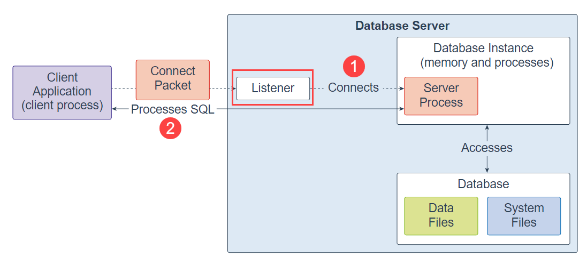

---
title: Oracle XE (Express Edition)
tags:
 - oracle
 - database
 - sql
--- 

Oracle XE (Express Edition) is the same powerful Oracle Database that enterprises rely on worldwide, packaged for simple download, ease-of-use, and a full-featured experience. You get an Oracle Database to use in any environment, plus the ability to embed and redistribute – all completely free!
<!--more-->

It should be noted that oracle runs using a client-server model. This means that there are different [files](https://community.oracle.com/tech/developers/discussion/295386/difference-between-listener-ora-and-tnsname-ora) (and commands) specific to the client and server roles of an Oracle XE database.

## Listener (Server Side)

The *listener* is a separate database server process that runs locally on the database server or remotely.

When a client request comes, the listener first receives it. And then the listener establishes a connection between the client and the database instance.

Once the client is connected to the database instance successfully, the listener hands over the client connection to the server process.

If the listener stops running, you cannot connect to the Oracle Database anymore. However, all the existing connections will not be affected.

### Listener commands

* `lsnrctl services` - checks the listener services that are running
* `lsnrctl stat` - prints the status of the listener
* `lsnrctl` - Starts the LSNRCTL interactive command line, more details can be found with `help`
* `lsnrctl stop` - Stops the listener service (needs to be run by the user who installed it, often admin/root)
* `lsnrctl start` - Starts the listener service

### listerer.ora

This file is used by the **listener** to determine what DB services to expose and the details of the host and port.

They are typically located in the `$ORACLE_HOME/network/admin/` folder.

    Windows sometimes does not set the ORACLE_HOME variable, in this case have a look in the path variable to see if there is an entry there

Take note that these are files are automatically generated as a part of the Oracle XE installation process and may need to be updated to change the `HOST` variable to something else (often to `HOST = localhost` for a localhost only connection, or the Hostname for a remote connection).

## Client Side

On the client side the connections that your pc uses are defined in the `$ORACLE_HOME/network/admin/tnsnames.ora` file.

To assist in diagnosing connection problems you can use the `tnsping` command, such as:

* `tnsping <HOSTNAME>`
* `tnsping <HOSTNAME> [<DATABASE_SID>]`

Another lower level (linux) diagnostic tool that can be used on the client side is `telnet`. With `telnet` you can determine if the server is listening on a given port:

`telnet <HOSTNAME> <PORT>`
